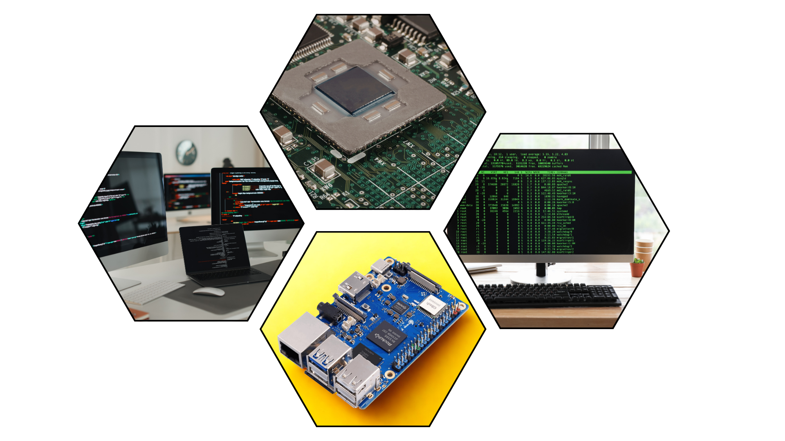
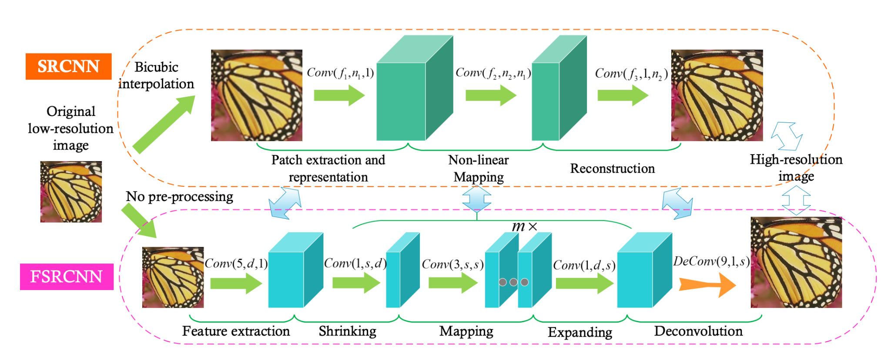
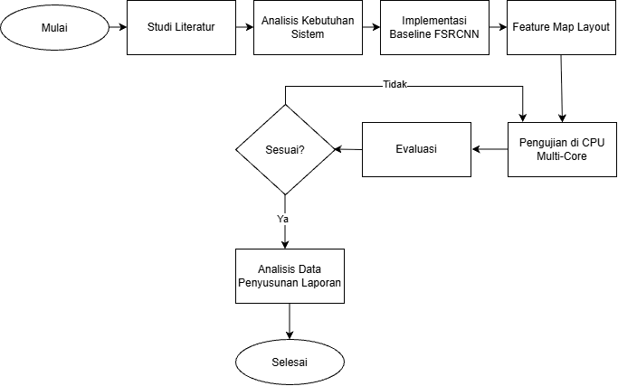
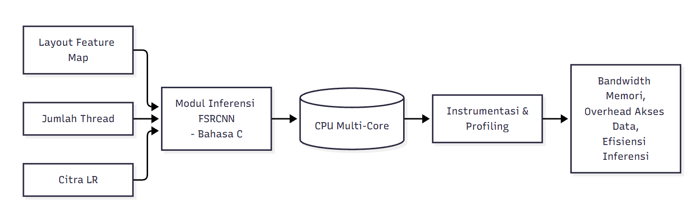

**PROPOSAL PENELITIAN**

**Analisis Pengaruh Pola Akses Feature Map dan Paralelisasi Spasial terhadap Tekanan Bandwidth Memori dan Efisiensi Inferensi Layer FSRCNN Berkanal Kecil pada CPU Multi-Core**

**Analisis Pengaruh Pola Akses Feature Map dan Paralelisasi Spasial terhadap Tekanan Bandwidth Memori dan Efisiensi Inferensi Layer FSRCNN Berkanal Kecil pada CPU Multi-Core**

**WA ODE RATNA ADININGSIH**

**D082252009**

**PROGRAM STUDI MAGISTER TEKNIK INFORMATIKA**

**DEPARTEMEN TEKNIK INFORMATIKA**

**FAKULTAS TEKNIK**

**UNIVERSITAS HASANUDDIN**

**GOWA**

**2026**

# LEMBAR PENGESAHAN PROPOSAL PENELITIAN

***FRAMEWORK* PENJADWALAN DINAMIS ADAPTIF BERBASIS *RUNTIME COST ESTIMATION* UNTUK *PIPELINE MULTITHREADING* PADA ARSITEKTUR ASIMETRIS (STUDI KASUS: FAST SUPER-RESOLUTION CONVOLUTIONAL NEURAL NETWORK)**

**M. Hamdani Ilham Latjoro**

**D082252019**

Disetujui untuk diseminarkan

**Komisi Pembimbing**

Pembimbing I

Prof. Dr. Adnan, S.T., M.T.

NIP: 19740426 200501 1 002

Ketua Program Studi S2 Informatika

Prof. Dr. Ir. Zahir Zainuddin, [M.Sc](http://m.sc)

NIP: 19640427 198910 1 002

# DAFTAR ISI

Halaman

[**LEMBAR PENGESAHAN PROPOSAL PENELITIAN**](#_heading=h.z2fhz3tbcuuv) **i**

[**DAFTAR ISI**](#_heading=h.6nx1xyw7gx92) **ii**

[**DAFTAR TABEL**](#_heading=h.v6saom1izrsm) **iv**

[**DAFTAR GAMBAR**](#_heading=h.r57kn6cxu8ir) **v**

[**BAB I**](#_heading=h.7y2mlor5w3v7) [**PENDAHULUAN 1**](#_heading=h.r15s5qakf0cg)

[1.1 Latar Belakang 1](#_heading=h.lu42gybw4d4f)

[1.2 Tinjaun Pustaka 4](#_heading=h.kjo5e8r657wz)

[1.2.1 Hukum Amdahl dan Hukum Gustafson 4](#_heading=h.dejwbjegq97y)

[1.2.1.1 Hukum Amdahl: Paradigma Beban Tetap 4](#_heading=h.eqixmeopq7rk)

[1.2.1.2 Hukum Gustafson: Paradigma Beban Skalabel 4](#_heading=h.nan462kzr8sd)

[1.2.1.3 Implikasi untuk Penjadwalan pada Arsitektur Asimetris 5](#_heading=h.aqew4egmklnh)

[1.2.2 Arsitektur Asimetris dan ARM *big.LITTLE* 5](#_heading=h.k03xwzfigz6p)

[1.2.2.1 Konsep Arsitektur Asimetris 5](#_heading=h.s44ztej26txx)

[1.2.2.2 Arsitektur ARM *big.LITTLE* 5](#_heading=h.3h4zpjptfpng)

[1.2.3 Konsep *Pipeline* dan Ketidakseimbangan Beban 7](#_heading=h.yhvrcpvnke6y)

[1.2.3.1 Definisi dan Karakteristik *Pipeline* 7](#_heading=h.15rns0epyzzn)

[1.2.3.2 Tantangan Ketidakseimbangan Beban dalam *Pipeline* 8](#_heading=h.tninqwmil483)

[1.2.3.3 Pendekatan Penjadwalan: Statis dan Dinamis 8](#_heading=h.tnhaa0u2tkh0)

[1.2.4 Estimasi Biaya Komputasi Dinamis *(Runtime Cost Estimation)* 9](#_heading=h.qsvw5ljvaa4e)

[1.2.4.1 Konsep Dasar Estimasi Biaya Melalui Kalibrasi Awal 9](#_heading=h.mhl32ccghvec)

[1.2.4.2 Penerapan Estimasi Biaya pada Arsitektur Asimetris 9](#_heading=h.jcbim7v95r74)

[1.2.5 Fast Super-Resolution Convolutional Neural Network (FSRCNN) 10](#_heading=h.i00qacckk809)

[1.2.5.1 Super-Resolusi Citra 10](#_heading=h.fksgbdqfkypl)

[1.2.5.2 Evolusi dari SRCNN ke FSRCNN 10](#_heading=h.ulfj7kucmj8e)

[1.2.5.3 Arsitektur FSRCNN 11](#_heading=h.byi4fbqqty6k)

[1.2.5.4 Karakteristik Beban Komputasi FSRCNN 12](#_heading=h.ck28i1u6nu05)

[1.3 Rumusan Masalah 12](#_heading=h.obou21hv7c9m)

[1.4 Hipotesa Penelitian 13](#_heading=h.if5ygazf0j29)

[1.5 Tujuan Penelitian 13](#_heading=h.2gt8wxn1diiy)

[1.6 Manfaat Penelitian 13](#_heading=h.r9slk1qfecvc)

[1.7 Batasan Masalah 14](#_heading=h.ljacyfebdby5)

[**BAB II**](#_heading=h.o88ri7sruvu5) [**METODOLOGI PENELITIAN 15**](#_heading=h.bw9uckqj9789)

[2.1 Jenis Penelitian 15](#_heading=h.th0cecbywj29)

[2.2 Waktu & Lokasi Penelitian 15](#_heading=h.dotuymwxrg5c)

[2.3 Tahapan Penelitian 15](#_heading=h.hj01ran89epu)

[2.4 Perangkat Penelitian 17](#_heading=h.jq72a4hcfd8f)

[2.5 Perancangan Sistem 19](#_heading=h.hjc3mvp87lgq)

[2.5.1 Gambaran Umum Arsitektur 19](#_heading=h.mfylaqogd80g)

[2.5.2 Perancangan Komponen Utama 19](#_heading=h.4afk5g7wicm)

[2.5.3 Integrasi Studi Kasus (FSRCNN) 21](#_heading=h.1i1ndzntmk4z)

[2.6 Definisi Operasional Variabel 21](#_heading=h.deokepkez5t4)

[2.7 Skenario Percobaan 22](#_heading=h.lw2kvcj7634n)

[2.8 Analisis Data 22](#_heading=h.bl02r7jsw4b2)

[**DAFTAR PUSTAKA 24**](#_heading=h.8rbgmx1b0dxd)

[**LAMPIRAN 27**](#_heading=h.g406ij4nsx9f)

[Lampiran 1. *State of the Arts* 28](#_heading=h.a0i0nzwvalg5)

# DAFTAR TABEL

Halaman

[Tabel 1. Lapisan FSRCNN 11](#_heading=h.3h8uvi4vdifs)

[Tabel 2. Daftar Perngkat Keras 17](#_heading=h.irka1mc5q0q)

[Tabel 3. Daftar Perngkat Lunak 17](#_heading=h.ozhwy5l71d4j)

[Tabel 4. Definisi Operasional Variabel 20](#_heading=h.hb7m0v51nrpb)

[Tabel 5. Skenario Percobaan 21](#_heading=h.4ny7v8wbrngp)

# DAFTAR GAMBAR

Halaman

[Gambar 1. Laundry analogi untuk *pipeline* 7](#_heading=h.an2ztay11xzh)

[Gambar 2. Arsitektur FSRCNN 11](#_heading=h.9gilsbszq7s7)

[Gambar 3. Tahapan Penelitain 16](#_heading=h.2wkq6z8rnt9g)

[Gambar 4. Gambaran Umum Arsitektur 19](#_heading=h.ua7ag0qxl9r8)

# BAB I

# PENDAHULUAN

## 1.1 Latar Belakang

Super-resolusi citra berbasis pembelajaran mendalam telah menjadi pendekatan dominan untuk merekonstruksi citra beresolusi tinggi dari citra beresolusi rendah, dengan Fast Super-Resolution Convolutional Neural Network (FSRCNN) sebagai salah satu arsitektur yang populer karena strukturnya yang ringkas dan efisien dibandingkan pendahulunya, SRCNN (Dong, Loy, & Tang, 2016). Arsitektur FSRCNN menyusun proses super-resolusi ke dalam tahapan feature extraction, shrinking, mapping, expanding, dan deconvolution, dengan jumlah kanal pada sebagian besar lapisan konvolusinya relatif kecil dibandingkan arsitektur CNN pada umumnya. Sebagai contoh, konfigurasi FSRCNN (56,12,4) dan varian yang lebih ringkas, FSRCNN (32,5,1), hanya memiliki sekitar 3.937 parameter namun mampu mencapai kecepatan inferensi 24,7 fps pada CPU generik menggunakan implementasi C++ pada studi aslinya, sehingga memenuhi syarat real-time (>24 fps) (Dong et al., 2016).

Kebutuhan akan inferensi super-resolusi yang cepat dan ringan semakin relevan seiring meluasnya penerapan model deep learning pada perangkat dengan sumber daya komputasi terbatas, seperti perangkat mobile, kamera pengawas, dan sistem embedded, yang pada banyak kasus tidak dilengkapi akselerator GPU dan harus mengandalkan CPU sebagai unit pemrosesan utama (Zhang, Zeng, & Zhang, 2021). Fenomena penting yang diamati pada konteks ini adalah bahwa pengurangan jumlah parameter dan FLOPs suatu model tidak selalu berbanding lurus dengan penurunan waktu eksekusi aktual di perangkat nyata, karena kecepatan eksekusi turut ditentukan oleh seberapa efisien pola akses memori dan pemanfaatan cache selama komputasi berlangsung, bukan semata-mata oleh jumlah operasi aritmetika yang harus dikerjakan (Zhang et al., 2021). Hal ini menjadi salah satu motivasi utama mengapa faktor arsitektural CPU, dan bukan hanya kompleksitas komputasi model, perlu dikaji secara eksplisit pada layer FSRCNN berkanal kecil.

Salah satu akar persoalan efisiensi inferensi pada CPU adalah kesenjangan yang terus melebar antara kecepatan peningkatan kinerja prosesor dan kecepatan peningkatan bandwidth memori, sebuah fenomena yang secara klasik dikenal sebagai "memory wall" (Wulf & McKee, 1995). Pada arsitektur CPU multi-core modern, kesenjangan ini diperparah oleh fakta bahwa bandwidth memori utama (main memory) pada umumnya dipakai bersama (shared) oleh seluruh core dalam satu chip, sementara kapasitas komputasi total justru bertambah seiring bertambahnya jumlah core. Akibatnya, ketika beban kerja komputasi per byte data yang dipindahkan (arithmetic intensity) rendah, seperti yang terjadi pada lapisan konvolusi berkanal kecil, performa inferensi cenderung dibatasi oleh kemampuan sistem memori untuk menyuplai data (memory-bound), bukan oleh kemampuan unit aritmetika CPU untuk mengolahnya (compute-bound). Hubungan antara arithmetic intensity dan batas performa yang dapat dicapai ini secara formal dijelaskan melalui roofline model, yang memetakan performa suatu kernel komputasi terhadap dua batas: batas bandwidth memori dan batas kapasitas komputasi puncak (Williams, Waterman, & Patterson, 2009). Inferensi jaringan konvolusi pada CPU sangat bergantung pada seberapa efektif hierarki memori cache (L1, L2, dan L3) dimanfaatkan untuk mengurangi lalu lintas data ke memori utama, karena setiap kegagalan cache (cache miss) menimbulkan latensi akses yang jauh lebih besar dibandingkan operasi aritmetika itu sendiri.

Dalam konteks tersebut, pola akses feature map memegang peranan penting karena menentukan bagaimana data feature map disusun secara fisik dalam memori, yang menyimpan seluruh nilai kanal pada satu posisi spasial secara berurutan. Kedua tata letak ini menghasilkan pola akses cache dan tingkat locality data yang berbeda ketika diproses oleh operasi konvolusi. Studi karakterisasi performa terbaru pada arsitektur SIMD menunjukkan bahwa pemilihan tata letak data dapat menghasilkan perbedaan throughput konvolusi yang sangat signifikan, berkisar antara 11% hingga 355%, bergantung pada dimensi kanal, tinggi, dan lebar dari setiap layer yang diuji (Fu, Zhang, Ma, Zhao, Lu, & Liu, 2024). Pada layer dengan jumlah kanal yang kecil, seperti yang mendominasi arsitektur FSRCNN, sensitivitas performa terhadap pilihan tata letak ini berpotensi lebih besar karena rasio antara data yang dapat digunakan kembali (reuse) dari cache dengan data yang harus diambil ulang dari memori utama menjadi lebih rendah dibandingkan pada layer dengan jumlah kanal besar.

Di sisi lain, paralelisasi pada dimensi spasial, yaitu pembagian beban kerja komputasi berdasarkan dimensi tinggi dan lebar feature map ke beberapa thread pada CPU multi-core, merupakan strategi umum untuk mempercepat inferensi, namun turut memengaruhi pola akses memori secara kolektif antar-core. Ketika beban kerja spasial dibagi secara tidak seimbang atau dengan granularitas yang terlalu halus antar-thread, dapat timbul kontensi pada shared cache (L2/L3) maupun overhead sinkronisasi antar-thread yang mengurangi efektivitas paralelisasi itu sendiri; penelitian pada implementasi konvolusi berkinerja tinggi menunjukkan bahwa strategi penggabungan (coalescing) beberapa dimensi ke dalam satu parallel loop diperlukan untuk mencapai keseimbangan beban kerja yang baik pada CPU dengan jumlah core yang besar (Fu et al., 2024). Pendekatan paralelisasi berbasis dekomposisi spasial juga telah dieksplorasi pada level arsitektur jaringan, di mana citra input dibagi menjadi beberapa sub-citra yang diproses secara independen sebelum digabungkan kembali, namun kajian tersebut umumnya berfokus pada aspek akurasi dan skalabilitas pelatihan model, bukan pada karakterisasi tekanan bandwidth memori saat inferensi pada CPU multi-core (Klawonn, Lanser, & Weber, 2023).

Interaksi antara pola akses feature map dan strategi paralelisasi spasial ini berpotensi menimbulkan tekanan bandwidth memori dan overhead akses data yang signifikan, terutama pada layer dengan jumlah kanal kecil di mana intensitas aritmetika relatif rendah, sehingga kombinasi kedua faktor tersebut dapat saling memperkuat maupun saling menetralkan pengaruhnya terhadap efisiensi inferensi secara keseluruhan. Namun, sejauh mana kombinasi kedua faktor tersebut memengaruhi efisiensi inferensi layer FSRCNN pada CPU multi-core secara spesifik belum banyak dikaji dalam literatur yang ada, yang umumnya lebih berfokus pada optimasi tata letak data secara terpisah dari strategi paralelisasi, atau pada arsitektur CNN dengan jumlah kanal besar yang karakteristik memory-bound-nya berbeda dari layer FSRCNN. Oleh karena itu, penelitian ini bermaksud menganalisis pengaruh pola akses feature map dan paralelisasi pada dimensi spasial terhadap tekanan bandwidth memori, overhead akses data, dan efisiensi inferensi pada layer FSRCNN berkanal kecil di CPU multi-core, sebagai dasar pemahaman untuk optimasi inferensi model super-resolusi pada perangkat dengan sumber daya komputasi terbatas.

## 1.2 Tinjaun Pustaka

### 1.2.1 Pola Akses feature Map

Feature map pada jaringan konvolusi secara logis berdimensi empat (N, C, H, W), namun secara fisik disimpan sebagai larik satu dimensi; urutan penyimpanan inilah yang disebut tata letak (layout) data, atau pola akses feature map (Fu, Zhang, Ma, Zhao, Lu, & Liu, 2024). Dua tata letak yang umum digunakan pada literatur adalah Channel-Height-Width (CHW) dan Height-Width-Channel (HWC), yang berbeda dalam urutan penyimpanan dimensi kanal, tinggi, dan lebar. Pemilihan tata letak memengaruhi locality data dan pola akses cache CPU ketika operasi konvolusi berlangsung, karena menentukan apakah elemen-elemen yang diakses bersamaan dalam satu operasi tersimpan berdekatan atau berjauhan di memori (Fu et al., 2024).

#### 1.2.2 Paralelisasi Spasial

Paralelisasi pada inferensi jaringan konvolusi dapat dilakukan pada beberapa dimensi tensor, di antaranya dimensi batch (data parallelism), kanal (channel/model parallelism), maupun spasial, yaitu tinggi dan lebar feature map (Sze, Chen, Yang, & Emer, 2017). Paralelisasi spasial membagi beban komputasi satu citra ke beberapa thread berdasarkan wilayah atau baris/kolom feature map, sehingga relevan untuk inferensi dengan ukuran batch kecil atau tunggal (N=1), seperti pada aplikasi super-resolusi citra atau video secara real-time (Fu, Zhang, Ma, Zhao, Lu, & Liu, 2024). Implementasi paralelisasi spasial pada CPU multi-core umumnya memanfaatkan pustaka thread seperti OpenMP, dengan loop pada dimensi spasial (atau kombinasi beberapa dimensi) dijadikan target directive paralel (Fu et al., 2024). Pendekatan paralelisasi berbasis dekomposisi spasial juga telah dieksplorasi pada level arsitektur jaringan, di mana citra input didekomposisi menjadi beberapa sub-citra yang diproses oleh CNN lokal secara independen sebelum digabungkan kembali (Klawonn, Lanser, & Weber, 2023).

#### 1.2.3 Tekanan Bandwith Memori

Bandwidth memori adalah volume data yang dapat dipindahkan antara CPU dan memori utama per satuan waktu; tekanan bandwidth memori muncul ketika kebutuhan data suatu komputasi mendekati atau melampaui kapasitas ini. Kesenjangan yang terus melebar antara laju peningkatan kecepatan prosesor dan kecepatan memori dikenal sebagai memory wall (Wulf & McKee, 1995), dan pada CPU multi-core kesenjangan ini diperparah karena bandwidth memori utama umumnya dipakai bersama (shared) oleh seluruh core. Roofline model (Williams, Waterman, & Patterson, 2009) memetakan performa suatu kernel terhadap arithmetic intensity-nya (rasio FLOPs terhadap byte data yang dipindahkan), dengan dua batas: batas kapasitas komputasi puncak (flat roof) dan batas bandwidth memori puncak (sloped roof); titik potong keduanya disebut ridge point. Kernel dengan arithmetic intensity di bawah ridge point tergolong memory-bound (dibatasi bandwidth memori), sedangkan di atasnya tergolong compute-bound (dibatasi kapasitas komputasi). Arithmetic intensity suatu layer konvolusi ditentukan oleh jumlah kanal, ukuran kernel filter, dan dimensi spasial feature map; layer berkanal kecil cenderung memiliki arithmetic intensity rendah sehingga lebih mudah menjadi memory-bound (Sze, Chen, Yang, & Emer, 2017).

### 1.2.4 Overhead Akses Data

Overhead akses data adalah biaya waktu tambahan yang timbul akibat proses pengambilan data dari memori, di luar waktu murni untuk komputasi aritmetika, dan muncul sebagai konsekuensi langsung dari kesenjangan kecepatan antara prosesor dan memori (Wulf & McKee, 1995). Sumber utamanya adalah cache miss: ketika data yang dibutuhkan tidak ditemukan pada suatu level cache (L1/L2/L3), permintaan diteruskan ke level berikutnya hingga memori utama, yang latensinya berorde puluhan hingga ratusan kali lebih besar dibandingkan cache L1 (Sze, Chen, Yang, & Emer, 2017). Pola akses yang tidak kontigu meningkatkan kemungkinan cache miss dibandingkan pola akses yang kontigu, sehingga overhead akses data berkaitan erat dengan pilihan tata letak feature map (Subbab 3.1) (Fu, Zhang, Ma, Zhao, Lu, & Liu, 2024). Pada paralelisasi spasial, overhead akses data juga dapat meningkat akibat kontensi pada shared cache antar-thread dan sinkronisasi fork/join (Subbab 3.2) (Fu et al., 2024), sehingga overhead ini tidak semata-mata ditentukan oleh satu faktor, melainkan interaksi antara layout dan strategi paralelisasi. Overhead akses data umum diukur secara proksi melalui jumlah cache miss per elemen output yang dihasilkan, atau persentase waktu CPU yang dihabiskan menunggu data (stall time) (Sze et al., 2017).

#### 1.2.5 Efesiensi Inferensi

Efisiensi inferensi merujuk pada seberapa cepat suatu model menghasilkan output, umumnya diukur dari dua sisi: waktu eksekusi (latency) dan throughput (jumlah elemen/operasi yang diproses per satuan waktu). Ambang umum untuk aplikasi real-time pada pemrosesan citra/video adalah >24 fps (frame per second); FSRCNN varian ringan (32,5,1) dirancang khusus untuk memenuhi ambang ini pada CPU generik (Dong, Loy, & Tang, 2016). Dengan demikian, efisiensi inferensi merupakan hasil gabungan dari tekanan bandwidth memori (Subbab 3.3) dan overhead akses data (Subbab 3.4), bukan sekadar fungsi dari kompleksitas komputasi (FLOPs) model itu sendiri.

### 1.2.6 Fast Super-Resolution Convolutional Neural Network (FSRCNN)

#### 1.2.6.1 Super-Resolusi Citra

Super-resolusi (SR) merupakan teknik untuk meningkatkan kualitas citra dengan cara merekonstruksi citra atau video beresolusi tinggi dari versi beresolusi rendah yang telah mengalami kompresi (Joseph & Jayakumar, 2024). Teknik ini dibutuhkan dalam berbagai bidang, antara lain televisi definisi tinggi (*high-definition television*), sistem pengawasan, pencitraan medis, citra satelit, serta pengenalan wajah.

Joseph dan Jayakumar (2024) memformulasikan proses degradasi citra resolusitinggi (HR) 𝔁 menjadi citra resolusi rendah (LR) 𝔂 secara matematis sebagai berikut:

𝔂 = (𝔁 ⊗ 𝒌) ↓s​ + n

Pada persamaan tersebut, (𝔁 ⊗ 𝒌) menyatakan konvolusi citra HR 𝔁 dengan kernel *blur* 𝒌, ↓s menyatakan proses *downsampling* dengan faktor skala s, sedangkan n adalah derau berupa *additive white Gaussian noise* (AWGN). Dengan demikian, super-resolusi pada dasarnya bertujuan membalik proses degradasi tersebut agar citra HR dapat direkonstruksi dari citra LR yang diamati..

#### 1.2.6.2 Evolusi dari SRCNN ke FSRCNN

Dong et al. (2015) memperkenalkan *Super-Resolution Convolutional Neural Network* (SRCNN) sebagai salah satu pelopor pemanfaatan *deep learning* dalam bidang super-resolusi. Dibandingkan metode konvensional, SRCNN unggul dari sisi kecepatan maupun kualitas hasil restorasi. Meskipun demikian, beban komputasinya yang besar membuat SRCNN belum mampu memenuhi kebutuhan aplikasi *real-time* (>24 FPS).

Sebagai solusi atas kendala tersebut, Dong et al. (2016) mengembangkan *Fast Super-Resolution Convolutional Neural Network* (FSRCNN) yang memuat tiga perbaikan utama:

1. Lapisan dekonvolusi pada bagian akhir jaringan.

Dengan menempatkan lapisan dekonvolusi di ujung jaringan, model dapat mempelajari pemetaan secara langsung dari citra resolusi rendah asli ke citra resolusi tinggi tanpa memerlukan interpolasi terlebih dahulu.

1. Arsitektur berbentuk *hourglass*

Dimensi fitur masukan dikecilkan sebelum tahap pemetaan, kemudian diperbesar kembali setelahnya, sehingga kompleksitas komputasi dapat ditekan.

1. Filter berukuran kecil dengan lapisan pemetaan yang lebih banyak

Ukuran filter diperkecil, tetapi jumlah lapisan pemetaan ditambah agar kualitas rekonstruksi tetap terjaga.

#### 1.2.6.3 Arsitektur FSRCNN

Arsitektur FSRCNN terdiri dari beberapa bagian utama (Gambar 2):

1. *Feature extraction*: lapisan konvolusi untuk mengekstraksi fitur dari citra beresolusi rendah.
2. *Shrinking*: lapisan yang mengurangi dimensi fitur untuk efisiensi komputasi.
3. *Mapping*: serangkaian lapisan konvolusi yang memetakan fitur ke representasi yang lebih kaya.
4. *Expanding*: lapisan yang memperluas kembali dimensi fitur.
5. *Deconvolution*: lapisan akhir yang melakukan *upscaling* untuk menghasilkan citra beresolusi tinggi.

###### Gambar 2. Arsitektur FSRCNN (Dong et al., 2016)

Annisa et al. (2025) melakukan penelitian terbaru terkait penerapan FSRCNN pada arsitektur prosesor asimetris. Dalam penelitian tersebut, kinerja paralelisasi FSRCNN pada prosesor big.LITTLE dianalisis melalui perbandingan sejumlah skenario alokasi inti yang bersifat statis. Hasilnya menunjukkan bahwa penggunaan 4 *big core* memberikan kualitas video dan waktu komputasi paling baik, sedangkan skenario hibrida (big.LITTLE) memberikan kompromi yang lebih seimbang, tetapi performanya masih berada di bawah konfigurasi *big core*.

Salah satu temuan penting dari penelitian tersebut adalah adanya *bottleneck* komputasi yang cukup besar pada layer 8, yaitu tahap dekonvolusi. Pada skenario paralel, lapisan ini mencatat peningkatan *speedup* terendah dibandingkan lapisan lainnya, sehingga menjadi penghambat utama kecepatan *pipeline* secara keseluruhan. Karena penelitian tersebut masih terbatas pada skenario alokasi inti yang statis, temuan ini menjadi dasar empiris yang kuat bagi penelitian ini untuk mengembangkan *framework* penjadwalan dinamis yang mampu menangani ketidakseimbangan beban pada tahap dekonvolusi secara adaptif.

#### 1.2.6.4 Karakteristik Beban Komputasi FSRCNN

FSRCNN memiliki karakteristik beban komputasi yang sangat bervariasi antar lapisan, menjadikannya studi kasus ideal untuk pengujian pada penelitian ini:

##### Tabel 1. Lapisan FSRCNN

| Lapisan | Ukuran Filter | Jumlah Filter | Beban Komputasi |
| --- | --- | --- | --- |
| *Feature Extraction* | 5x5 | 56 | Sedang |
| *Shrinking* | 1x1 | 12 | Rendah |
| *Mapping (x4)* | 3x3 | 12 | Sedang |
| *Expanding* | 1x1 | 56 | Rendah |
| *Deconvolution* | 9x9 | 1 | Sangat Tinggi |

Beban komputasi pada lapisan dekonvolusi yang terletak di ujung jaringan jauh lebih besar daripada lapisan-lapisan lainnya, sehingga secara alami membentuk *bottleneck* dalam *pipeline* pemrosesan. Ketidakseimbangan inilah yang menjadi target utama *framework* berbasis *runtime cost estimation* yang dikembangkan dalam penelitian ini.

## 1.3 Rumusan Masalah

Bagaimana pengaruh pola akses feature map dan paralelisasi pada dimensi spasial terhadap tekanan bandwidth memori, overhead akses data, dan efisiensi inferensi pada layer FSRCNN dengan jumlah kanal yang relatif kecil di CPU multi-core?

## 1.4 Hipotesa Penelitian

Jika pola akses feature map disesuaikan dengan karakteristik reuse spasial dan paralelisasi diarahkan pada dimensi spasial, maka tekanan terhadap sistem memori dan overhead akses data pada layer FSRCNN dengan jumlah kanal yang relatif kecil dapat dikurangi, sehingga efisiensi inferensi CPU meningkat.

## 1.5 Tujuan Penelitian

Sesuai dengan rumusan masalah di atas, penelitian ini bertujuan untuk:

1. Menganalisis pengaruh pola akses feature map terhadap tekanan bandwidth memori pada layer FSRCNN berkanal kecil di CPU multi-core.
2. Menganalisis pengaruh skema paralelisasi pada dimensi spasial terhadap overhead akses data pada layer FSRCNN berkanal kecil di CPU multi-core.
3. Menganalisis pengaruh gabungan pola akses feature map dan paralelisasi spasial terhadap efisiensi inferensi layer FSRCNN berkanal kecil di CPU multi-core, serta merumuskan rekomendasi kombinasi pola akses dan strategi paralelisasi yang paling efisien.
4. Menganalisis pengaruh pola akses feature map terhadap tekanan bandwidth memori pada inferensi layer FSRCNN berkanal kecil di CPU multi-core.
5. Menganalisis pengaruh paralelisasi pada dimensi spasial terhadap overhead akses data pada inferensi layer FSRCNN berkanal kecil di CPU multi-core.
6. Menganalisis pengaruh kombinasi pola akses feature map dan paralelisasi spasial terhadap efisiensi inferensi layer FSRCNN berkanal kecil di CPU multi-core.

## 1.6 Manfaat Penelitian

Penelitian ini diharapkan dapat memberikan manfaat sebagai berikut:

**1.6.1 Manfaat Teoritis**

1. Memberikan kontribusi berupa pola arsitektural umum untuk *pipeline* paralel adaptif yang dapat menjadi rujukan dalam pengembangan sistem komputasi paralel pada berbagai domain aplikasi.
2. Memperkaya khazanah ilmu pengetahuan di bidang *dynamic load balancing* khususnya dalam konteks *pipeline* *multithreading* dengan arsitektur asimetris.
3. Menyediakan landasan teoretis bagi pengembangan lebih lanjut mekanisme prioritisasi dinamis berbasis *machine learning* pada *pipeline* paralel.

**1.6.2 Manfaat Praktis**

1. Menghasilkan *framework* perangkat lunak yang siap digunakan oleh pengembang aplikasi *pipeline* untuk meningkatkan efisiensi pemrosesan data tanpa harus membangun mekanisme *offline profiling* dari awal.
2. Memberikan solusi konkret bagi peningkatan kecepatan pemrosesan super-resolusi citra menggunakan FSRCNN, yang bermanfaat untuk aplikasi *real-time* seperti peningkatan kualitas video *streaming* atau citra medis.
3. Menyediakan panduan implementasi *runtime cost estimation* yang dapat diadaptasi pada berbagai industri yang membutuhkan pemrosesan *pipeline* skala besar seperti *rendering* animasi, *encoding* video, dan pemrosesan sinyal radar.

## 1.7 Batasan Masalah

Agar penelitian ini lebih terfokus dan terarah, ditetapkan beberapa batasan sebagai berikut:

1. Penelitian difokuskan pada layer-layer arsitektur FSRCNN dengan jumlah kanal yang relatif kecil, tidak mencakup arsitektur super-resolusi lain dengan jumlah kanal besar.
2. Pola akses feature map yang dianalisis dibatasi pada dua format layout data, yaitu Channel-Height-Width (CHW) dan Height-Width-Channel (HWC).
3. Paralelisasi yang dianalisis dibatasi pada paralelisasi dimensi spasial (tinggi dan lebar feature map), tidak mencakup paralelisasi pada dimensi kanal atau batch.
4. Implementasi eksperimen dilakukan menggunakan bahasa pemrograman C, tanpa memanfaatkan pustaka deep learning framework tingkat tinggi (seperti PyTorch atau TensorFlow).
5. Pengujian dilakukan pada CPU multi-core, tidak mencakup akselerator perangkat keras lain seperti GPU, TPU, atau FPGA.
6. Metrik yang diukur difokuskan pada tekanan bandwidth memori, overhead akses data, dan efisiensi inferensi (waktu eksekusi dan/atau throughput), tidak mencakup evaluasi terhadap kualitas hasil super-resolusi (seperti PSNR atau SSIM).

# BAB II

# METODOLOGI PENELITIAN

## 2.1 Jenis Penelitian

Menurut OECD (2015), kegiatan Penelitian dan Pengembangan (R&D) mencakup tiga komponen utama, yaitu penelitian dasar, penelitian terapan, dan pengembangan eksperimental. Penelitian ini menggunakan pendekatan *applied research* yang bertujuan untuk menghasilkan produk berupa *framework* perangkat lunak sekaligus menguji efektivitasnya. Pendekatan ini dipilih karena sesuai dengan karakteristik penelitian yang tidak hanya mengembangkan artefak *(framework pipeline multithreading)*, tetapi juga melakukan evaluasi kuantitatif terhadap kinerja artefak tersebut pada studi kasus nyata.

Jenis penelitian ini termasuk dalam kategori eksperimental komparatif, di mana performa *framework* yang dikembangkan dibandingkan dengan pendekatan *baseline (pipeline statis)* melalui pengukuran metrik kinerja terukur.

## 2.2 Waktu & Lokasi Penelitian

Penelitian ini dilaksanakan sejak bulan Februari hingga Desember 2026. Studi literatur dan perancangan *framework* dilakukan pada bulan Februari hingga awal April. Implementasi *framework* dan FSRCNN dilaksanakan pada bulan Mei hingga Juli, sedangkan pengujian, evaluasi, serta analisis hasil dilakukan pada bulan Agustus hingga Desember. Tahap akhir berupa revisi dan finalisasi laporan diselesaikan pada bulan Desember 2026.

Seluruh rangkaian penelitian bertempat di Laboratorium IOT & Komputasi Parallel, Fakultas Teknik, Universitas Hasanuddin. Proses pengembangan perangkat lunak dan pengujian kinerja menggunakan perangkat keras Orange Pi 5 dengan spesifikasi sebagaimana diuraikan pada subbab 2.4.1 serta perangkat lunak pendukung yang telah ditentukan.

## 2.3 Tahapan Penelitian

###### Gambar 3. Tahapan Penelitain

Tahapan penelitian disusun secara sistematis mengikuti model pengembangan R&D yang dikemukakan oleh OECD (2015), yaitu sebuah aktivitas R&D harus memenuhi lima kriteria utama: bersifat baru (*novel*), kreatif, memiliki ketidakpastian dalam hasil akhir (*uncertain*), dilakukan secara sistematis, serta dapat ditransfer atau direproduksi.

Adapun tahapan yang dilakukan dalam penelitian ini adalah sebagai berikut:

**2.3.1 Studi Literatur**

Mengkaji teori dan penelitian terkait yang relevan, meliputi arsitektur FSRCNN, tata letak data, paralelisasi spasial, tekanan bandwidth memori, overhead akses data, efisiensi inferensi, dan karakteristik CPU multi-core sebagai landasan utama untuk penelitian ini.

**2.3.2 Analisis Kebutuhan Sistem**

Pada tahap ini dilakukan identifikasi spesifikasi teknis perangkat keras dan perangkat lunak yang diperlukan. Di sisi hardware, dilakukan karakterisasi *platform* target (Orange Pi 5 dengan SoC RK3588S) meliputi jumlah inti fisik, topologi *cache*, dan kebijakan frekuensi CPU (DVFS). Di sisi software, ditentukan kebutuhan pustaka sistem (POSIX Threads), kompiler, serta format data input/output. Selain itu, dirumuskan metrik keberhasilan *(Key Performance Indicators)* seperti *throughput* (FPS), *latency per frame*, CPU *utilization*, dan *energy efficiency* (EDP).

**2.3.3 Implementasi Baseline FSRCNN**

Tahap ini berfokus pada transformasi konsep teoritis menjadi cetak biru arsitektur perangkat lunak *(software blueprint)*. Perancangan mencakup pendefinisian struktur data internal (seperti *Task Wrapper, Stage Queue,* dan *Reorder Buffer*), mekanisme sinkronisasi *(mutex dan condition variables)*, serta arsitektur alur kerja *(workflow)* antarkomponen. Pada tahap ini, mekanisme *Runtime Cost Estimation (RCE)* diformulasikan melalui pendekatan kalibrasi awal *(initial calibration)* yang dilakukan sekali pada fase *warm-up* untuk menghasilkan nilai estimasi biaya tetap yang disimpan dalam *cost table* pada *shared memory*. Selain itu, dirancang pula logika *decision engine* bagi *worker thread* untuk memilih stage yang tepat berdasarkan estimasi biaya tersebut *(cost-aware decision)*. Dengan menetapkan biaya di awal, sistem dapat mengalokasikan sumber daya secara dinamis tanpa beban komputasi berlebih dari pemanggilan *system call* waktu yang berulang kali. Detail spesifikasi teknis arsitektur ini akan dibahas mendalam pada subbab terpisah (Perancangan Sistem).

**2.3.4 Feature Map *Layout***

Proses penerjemahan rancangan ke dalam kode program yang dapat dieksekusi. Implementasi dilakukan menggunakan bahasa pemrograman C untuk memastikan efisiensi memori dan kedekatan dengan *system call* kernel Linux. Komponen utama yang dibangun meliputi *Worker Pool Manager* (mengatur afinitas *thread* ke *Big/Little* *core)*, *Priority Scheduler* (algoritma pengambilan tugas dinamis), dan *Backpressure Controller* (mencegah *overflow* pada antrean). Selama implementasi, diterapkan praktik pemrograman paralel yang aman *(thread-safe)* untuk menghindari *race condition* dan *deadlock*.

**2.3.5 Pengujian di CPU Multi-Core**

Tahap integrasi objek penelitian ke dalam *framework* yang telah dibangun. Model Fast Super-Resolution Convolutional Neural Network (FSRCNN) dipecah menjadi 8 tahap *pipeline* sesuai dengan arsitektur lapisannya. Fungsi pemrosesan setiap lapisan (*convolution*, *shrinking*, *mapping*, *deconvolution*) dikodekan sebagai fungsi *callback* yang akan dipanggil oleh *worker*. Selain itu, disiapkan modul pra-pemrosesan data (pembacaan file YUV, normalisasi piksel) dan pasca-pemrosesan (penulisan hasil super-resolusi).

**2.3.6 Evaluasi**

Eksperimen dilaksanakan secara terkontrol di lingkungan laboratorium. Variabel bebas berupa skenario penjadwalan (Statis dan Dinamis) dan konfigurasi *worker* (jumlah *thread big.LITTLE*) divariasikan untuk mengukur variabel terikat (*throughput, latency*, utilisasi CPU). Data dikumpulkan secara kuantitatif menggunakan *profiling tools* standar Linux (seperti perf dan time). Jika hasil pengujian menunjukkan anomali atau inkonsistensi data, proses kembali ke tahap revisi dan optimasi untuk penyempurnaan algoritma.

**2.3.7 Analisis dan Pelaporan**

Data kuantitatif yang terkumpul dianalisis menggunakan metode statistik deskriptif dan komparatif. Tahap ini bertujuan membuktikan hipotesis penelitian bahwa penjadwalan *CPU* *core* asimetris yang menugaskan tahap *pipeline* berat ke *big* *core* dan tahap ringan ke *little* *core* secara adaptif berbasis *Runtime Cost Estimation (RCE)*. Analisis juga mencakup evaluasi efektivitas metode RCE dalam mengurangi *bottleneck* pada *layer* dekonvolusi dibandingkan dengan metode penjadwalan konvensional.

Tahap akhir mencakup kompilasi seluruh proses penelitian, hasil temuan, dan kesimpulan akademis ke dalam bentuk dokumen tesis. Penyusunan laporan mengikuti pedoman penulisan karya ilmiah standar, dilengkapi dengan visualisasi data (grafik dan tabel) serta rekomendasi untuk penelitian lanjutan.

## 2.4 Perangkat Penelitian

**2.4.1 Perangkat Keras**

##### Tabel 2. Daftar Perangkat Keras

| Komponen | Spesifikasi | Fungsi |
| --- | --- | --- |
| *Single Board Computer* | Orange Pi 5 (Rockchip RK3588S, 4x Cortex-A76 @2.4 GHz, 4x Cortex-A55 @1.8 GHz, RAM 8 GB) | *Platform* eksekusi utama |
| Media Penyimpanan | MicroSD 64 GB, SSD 128 GB | Penyimpanan sistem operasi, kode sumber, dan data uji |
| Perangkat Tambahan | Keyboard, mouse, monitor, kabel HDMI | Interaksi dan *debugging* |

**2.4.2 Perangkat Lunak**

##### Tabel 3. Daftar Perangkat Lunak

| Komponen | Spesifikasi | Fungsi |
| --- | --- | --- |
| Sistem Operasi | Ubuntu 22.04 LTS (ARM64) | Lingkungan pengembangan dan eksekusi |
| Compiler | GCC 15.2.0 (dengan dukungan pthread) | Kompilasi kode sumber |
| *Editor* / IDE | Visual Studio Code | Pengembangan kode |
| Version Control | Git & Github | Manajemen versi kode sumber |

**2.4.3 Data Uji**

Data uji berupa file YUV 4:2:0 dengan spesifikasi:

1. Resolusi: 176x144 piksel (format QCIF)
2. Jumlah frame: 150 *frame*
3. Format: YUV420p
4. Sumber: Dataset video konferensi umum atau sintetis
5. Data uji digunakan sebagai masukan *pipeline* untuk menguji kinerja *framework* dalam memproses aliran video.

## 2.5 Perancangan Sistem

Perancangan sistem ini bertujuan untuk membangun sebuah *framework pipeline multithreading* yang bersifat adaptif terhadap heterogenitas *hardware*. *Framework* ini dirancang untuk menyeimbangkan beban kerja secara dinamis pada arsitektur asimetris *(big.LITTLE)* menggunakan metode *Runtime Cost Estimation (RCE)*.

### 2.5.1 Gambaran Umum Arsitektur

Secara umum, *framework* ini mengadopsi pola desain *Producer-Consumer* yang dimodifikasi dengan mekanisme *Pull-Based Scheduling*. Berbeda dengan *pipeline* tradisional yang menetapkan satu *thread* tetap untuk satu tahap *(stage)*, *framework* ini menggunakan *Worker Pool* yang fleksibel. Setiap *worker (thread)* memiliki kemampuan untuk mengeksekusi tahap mana pun dalam *pipeline* secara dinamis berdasarkan estimasi beban kerja yang telah di kalkulasi.

Arsitektur sistem terdiri dari lima komponen utama:

1. Tiga Input Sistem : Sistem usulan menerima tiga masukan yang mengalir bersamaan ke dalam Modul Inferensi FSRCNN. *Citra LR* adalah data uji berupa citra beresolusi rendah yang akan diinferensi. *Layout Feature Map* adalah parameter yang menentukan tata letak penyimpanan feature map yang akan digunakan pada seluruh lapisan FSRCNN selama satu proses inferensi, yaitu CHW atau HWC. *Jumlah Thread* adalah parameter yang menentukan derajat paralelisasi spasial yang diterapkan, dengan nilai 1, 2, 4, atau 8. Kedua parameter terakhir ini merupakan representasi langsung dari dua variabel bebas penelitian, dan nilainya ditentukan oleh skenario pengujian yang sedang dijalankan bukan nilai tetap, melainkan berubah-ubah mengikuti kombinasi skenario yang diuji.
2. Modul Inferensi FSRCNN : Ketiga input di atas diproses oleh Modul Inferensi FSRCNN, yaitu program inti yang diimplementasikan murni dalam bahasa C tanpa framework deep learning tingkat tinggi. Berdasarkan nilai parameter Layout Feature Map yang diterima, modul ini menyusun buffer feature map menggunakan fungsi pengindeksan CHW atau HWC yang sesuai , kemudian menjalankan kelima lapisan FSRCNN (feature extraction, shrinking, mapping, expanding, deconvolution) di atas buffer tersebut. Berdasarkan nilai parameter Jumlah Thread, modul ini juga mengaktifkan paralelisasi OpenMP pada loop dimensi spasial dengan derajat paralelisme yang sesuai. Dengan demikian, satu modul yang sama digunakan untuk menjalankan seluruh 16 skenario pengujian, hanya berbeda pada parameter yang diberikan — sehingga perbedaan hasil antar-skenario dapat diatribusikan murni pada perbedaan layout dan jumlah thread, bukan pada perbedaan implementasi.
3. CPU Multi-Core : Modul Inferensi FSRCNN dieksekusi pada CPU multi-core, yaitu perangkat keras fisik tempat seluruh komputasi benar-benar berlangsung
4. Instrumentasi dan Profiling : Selama proses eksekusi pada CPU multi-core berlangsung, komponen Instrumentasi & Profiling membaca hardware performance counter secara langsung melalui perf atau PAPI, mencakup jumlah cache miss pada tiap level cache, estimasi bandwidth memori yang terpakai, dan waktu eksekusi pada resolusi nanodetik. Komponen ini bekerja secara non-intrusif, artinya pengukuran dilakukan tanpa mengubah logika komputasi inferensi itu sendiri, sehingga angka yang tercatat mencerminkan performa aktual modul inferensi pada konfigurasi layout dan jumlah thread yang sedang diuji.
5. Bandwith Memori, Overhead Akses Data dan Efesiensi Inferensi : Hasil akhir dari komponen Instrumentasi & Profiling adalah nilai tiga variabel terikat penelitian, yaitu tekanan bandwidth memori, overhead akses data, dan efisiensi inferensi

###### Gambar 4. Gambaran Umum Arsitektur

### 2.5.2 Perancangan Komponen Utama

1. *Worker Pool* Asimetris

Komponen ini menggantikan model *thread-per-stage* yang kaku. *Worker pool* dirancang dengan mempertimbangkan topologi arsitektur asimetris dalam hal ini seperti pada Orange Pi 5 (RK3588S).

1. Klasifikasi *Thread*: *Thread* pekerja dibagi menjadi dua kelompok saat inisialisasi: *Big Workers* dan *Little Workers*.
2. *CPU* *Affinity*: Setiap kelompok *thread* diikatkan secara programatis ke inti fisik yang sesuai.

- *Big Workers* diikat ke *core* 0-3 (Cortex-A76).
- *Little Workers* diikat ke *core* 4-7 (Cortex-A55).

Hal ini memastikan bahwa *scheduler* memiliki kendali penuh atas penempatan tugas di tingkat hardware.

1. *Engine Runtime Cost Estimation (RCE)*

RCE adalah komponen inovatif yang menggantikan kebutuhan *offline* *profiling* tradisional. Berbeda dengan metode adaptif yang memonitor setiap iterasi, RCE menggunakan pendekatan kalibrasi awal *(initial calibration)* untuk meminimalkan *overhead runtime*.

1. Mekanisme Pengukuran: Pengukuran waktu eksekusi aktual (t actual) hanya dilakukan sekali pada fase awal eksekusi (proses *warm-up*), di mana sistem memproses satu sampel data awal melalui seluruh tahap *pipeline*.
2. Penentuan Biaya: Hasil pengukuran dari proses awal ini langsung digunakan untuk mengisi tabel estimasi biaya *(cost)* pada *shared memory*.
3. Efisiensi Komputasi: Dengan menerapkan estimasi biaya yang ditetapkan di awal, sistem tidak perlu melakukan pengukuran waktu pada *frame-frame* berikutnya *(steady-state)*. Hal ini secara signifikan mengurangi beban komputasi sistem, menghilangkan *overhead* pemanggilan fungsi *timing* di dalam *loop* utama pemrosesan.
4. *Adaptive Task Scheduler*

*Scheduler* adalah logika keputusan yang berjalan di setiap *worker thread*. Berbeda dengan *scheduler* standar (FIFO), *scheduler* ini menggunakan strategi *cost-aware*:

1. Logika *big* *core*: memprioritaskan pengambilan tugas dari *stage queue* dengan nilai *cost* tertinggi (tugas berat). Ini memastikan *core* yang kuat menangani bagian yang paling sulit.
2. Logika *little* *core*: Memprioritaskan pengambilan tugas dari *stage queue* dengan nilai *cost* terendah (tugas ringan). Ini memastikan *core* hemat daya tidak kewalahan.
3. *Fallback Mechanism:* Jika antrean prioritas kosong, *worker* dapat mengambil tugas dari antrean mana pun untuk mencegah *starvation* (memecahkan *thundering herd problem*).
4. *Reorder Buffer* dan *Backpressure*
5. *Reorder Buffer:* Karena sifat eksekusi paralel yang *out-of-order* (tugas bisa selesai tidak berurutan), komponen ini menyimpan hasil sementara sebelum ditulis ke *disk*. *Consumer thread* akan menunggu hingga *frame* dengan ID berurutan tiba sebelum melakukan *write*.
6. *Backpressure Control:* Mekanisme sinkronisasi kondisional yang memblokir *producer* jika antrean penuh. Ini mencegah *memory* *overflow* dan memaksa sistem menunggu hingga ada ruang kosong, menjaga stabilitas sistem secara alami.

### 2.5.3 Integrasi Studi Kasus (FSRCNN)

Untuk memvalidasi desain *framework*, aplikasi FSRCNN dipetakan ke dalam arsitektur *pipeline* sebagai berikut:

1. Pemecahan Model: Model FSRCNN dibagi menjadi 8 tahap, di mana setiap tahap merepresentasikan satu lapisan jaringan saraf.
2. *Callback Registration:* Fungsi pemrosesan setiap layer (mulai dari *Feature Extraction* hingga *Deconvolution*) didaftarkan sebagai fungsi *callback* ke dalam *array* *stages* pada konfigurasi *framework*.
3. Eksekusi: Data piksel video mengalir melewati *stage queue* 0 hingga *stage queue* 7. *Worker* secara dinamis mengambil data ini, memprosesnya sesuai *callback* yang terdaftar, lalu mendorongnya ke antrean berikutnya. Lapisan *deconvolution* (layer 8) yang berat akan secara otomatis dikerjakan oleh *big* *core* berkat mekanisme RCE.

Dengan perancangan sistem ini, diharapkan *framework* mampu mendistribusikan beban kerja secara proporsional, memaksimalkan utilisasi *big core*, dan mengoptimalkan efisiensi energi *little core* tanpa intervensi manual pengguna.

## 2.6 Definisi Operasional Variabel

##### Tabel 4. Definisi Operasional Variabel

| Variabel | Definisi Operasional | Metode Pengukuran |
| --- | --- | --- |
| Pola Akses Feature Map | Tata letak penyimpanan feature map dalam memori, yang menentukan urutan pengindeksan elemen tensor | total\_frames / total\_processing\_time diukur dengan fungsi gettimeofday |
| Paralelisasi Spasial | Jumlah thread OpenMP yang digunakan untuk membagi komputasi pada dimensi tinggi feature map keluaran | Menggunakan perf *stat* -e *cpu-clock* atau mpstat pada interval 1 detik |
| Tekanan Bandwith Memori | Volume data yang dipindahkan antara CPU dan memori utama per satuan waktu selama eksekusi satu lapisan/inferensi (GB/detik) | Pengukuran dengan gettimeofday saat feed dan saat consumer menulis |
| Overhead Akses Data | Selisih antara waktu eksekusi aktual dengan waktu eksekusi teoretis pada kondisi compute-bound sempurna, atau jumlah cache miss per elemen output yang dihasilkan (dan/atau persentase waktu stall) | Log internal *framework* yang mencatat frame yang tidak langsung dapat ditulis |
| Efisiensi Inferensi | Kecepatan proses inferensi satu lapisan/citra, diukur dari waktu eksekusi total (milidetik) dan throughput (elemen/detik atau GFLOP/s) | throughput\_dinamis / throughput\_statis |

## 2.7 Skenario Percobaan

Percobaan dirancang untuk menguji hipotesis bahwa *framework* berbasis *Runtime Cost Estimation (RCE)* dapat meningkatkan utilisasi sumber daya dan *throughput* dibandingkan dengan *pipeline* statis. Skenario yang diuji:

##### Tabel 5. Skenario Percobaan

| Skenario | Konfigurasi | Tujuan |
| --- | --- | --- |
| A *(Baseline)* | *Pipeline* statis dengan 8 thread (1 *thread* *per* *layer*) | Menetapkan *baseline* kinerja |
| B | *Framework* dengan 4 *worker* | Menguji skalabilitas pada jumlah *worker* di bawah jumlah *core* |
| C | *Framework* dengan 8 *worker* | Menguji skalabilitas pada jumlah *worker* setara *core* fisik |
| D | *Framework* dengan 12 *worker* *(oversubscription)* | Menguji batas *throughput* dan efek *oversubscription* |

## 2.8 Analisis Data

Analisis data dilakukan dengan pendekatan kuantitatif deskriptif dan komparatif. Langkah-langkah analisis:

1. Perhitungan statistik deskriptif: rata-rata, standar deviasi, dan rentang nilai untuk setiap metrik pada setiap skenario.
2. Perbandingan kinerja: menggunakan grafik batang untuk membandingkan *throughput* dan utilisasi CPU antarskenario.
3. Analisis *speedup*: menghitung rasio peningkatan *throughput* *framework* dinamis terhadap *baseline*.
4. Analisis *bottleneck*: mengidentifikasi tahap yang menjadi *bottleneck* melalui distribusi waktu eksekusi per tahap.

Hasil analisis akan menjawab rumusan masalah penelitian dan membuktikan atau menggugurkan hipotesis yang diajukan.

# DAFTAR PUSTAKA

Adnan, A., 2023. Performance evaluation on work-stealing featured parallel programs on asymmetric performance multicore processors. Array 19, 100311. doi:10.1016/j.array.2023.100311.

Al-Shaikh, A., Shaheen, A., Rasmi Al-Mousa, M., Alqawasmi, K., Al Sherideh, A.S., dan Khattab, H., 2023. A Comparative Study on the Performance of 64-bit ARM Processors. International Journal of Interactive Mobile Technologies (iJIM) 17 (13): 94–113. https://doi.org/10.3991/ijim.v17i13.39395.

Amdahl, G. M., 1967. Validity of the single-processor approach to achieving large-scale computing capabilities. Proceedings of AFIPS Conference, 483-485.

Annisa, Adnan, and Zainuddin Z, 2025. Enhancing Computational Efficiency: Transitioning from Serial to Parallel Programming for Low-to-High Resolution Video Reconstruction Using FSRCNN on AMP Architecture. IEEE Proceedings of 2025 IEEE International Conference on Artificial Intelligence and Mechatronics Systems (AIMS). doi: 10.1109/AIMS66189.2025.11229650.

Arm., 2026. big.LITTLE: Balancing Power Efficiency and Performance, Arm Technologies. Available at <https://www.arm.com/technologies/big-little>. [Accessed on 1 April 2026]

Chronaki, K., Rico, A., Casas, M., Moretó, M., Badia, R. M. and Ayguadé, E., 2017. Task scheduling techniques for asymmetric multi-core systems. IEEE Transactions on Parallel and Distributed Systems 28(7). 2074–2087. doi:10.1109/TPDS.2016.2633347.

Cho, S., Lee, H., and Kim, J., 2025. LibraPIM: Dynamic Batch Offloading for Efficient Heterogeneous Computing with Processing-in-Memory. IEEE Proceedings of 2025 34th International Conference on Parallel Architectures and Compilation Techniques (PACT 2025). doi: 10.1109/PACT65351.2025.00016.

Dong, C., Loy, C. C., He, K., & Tang, X. 2015. Image Super-Resolution Using Deep Convolutional Networks (arXiv:1501.00092). arXiv. https://doi.org/10.48550/arXiv.1501.00092

[Dong, C., Loy, C. C., & Tang, X. 2016. Accelerating the Super-Resolution Convolutional Neural Network. In B. Leibe, J. Matas, N. Sebe, & M. Welling (Eds), Computer Vision – ECCV 2016. 9906.](https://www.zotero.org/google-docs/?Lu5Bj4)

[391–407. Springer International Publishing. https://doi.org/10.1007/978-3-319-46475-6\_25](https://www.zotero.org/google-docs/?Lu5Bj4).

Gao, Y., Zhang, Z., Donta, P. K., Dehury, C. K., Wang, X., and Niyato, D., 2025. Optimizing Multi-DNN Inference on Mobile Devices through Heterogeneous Processor Co-Execution. IEEE Transactions on Mobile Computing, Early Access, 1–16. doi:10.1109/TMC.2025.3647031.

Gustafson, J. L. 1988. Reevaluating Amdahl's Law. Communications of the ACM, 31(5), 532–533.

Harlap, A., Narayanan, D., Phanishayee, A., Seshadri, V., Devanur, N., Ganger, G., and Gibbons, P., 2018. PipeDream: Fast and efficient pipeline parallel DNN training. arXiv preprint arXiv:1806.03377. doi:10.48550/arXiv.1806.03377.

Hill, M. D., and Marty, M. R., 2008. Amdahl's Law in the Multicore Era. Computer. IEEE Proceedings of 2008 14th International Symposium on High Performance Computer Architecture. 33–38. doi: 10.1109/HPCA.2008.4658638

Hu, Y., Imes, C., Zhao, X., Kundu, S., Beerel, P. A., Crago, S. P., and Walters, J. P., 2021. Pipeline parallelism for inference on heterogeneous edge computing. arXiv preprint arXiv:2110.14895. doi:10.48550/arXiv.2110.14895.

Jiang, J., Huang, Z., and Huang, D., 2023. Hierarchical model parallelism for optimizing inference on many-core CPUs. ACM Transactions on Architecture and Code Optimization 20(3), Article 42, 1–21. doi:10.1145/3605149.

Joseph, G., and Jayakumar, E. P., 2024. Quantized Neural Network Architecture for Hardware-Efficient Real-Time 4K Image Super-Resolution. IEEE Proceedings of 2024 28th International Symposium on VLSI Design and Test (VDAT). doi: 10.1109/VDAT63601.2024.10705704

Min, Y. I. and Eom, Y. I., 2013. DANBI: Dynamic Scheduling of Irregular Stream Programs for Many-Core Systems. Proceedings of the 22nd International Conference on Parallel Architectures and Compilation Techniques. doi: 10.1109/PACT.2013.6618816.

Mastoras, A., and Gross, T., 2018. Unifying fixed code and fixed data mapping for pipelined loops. IEEE Transactions on Parallel and Distributed Systems. 29(9), 2136–2149. doi: 10.1109/TPDS.2018.2817207

Mastoras, A., 2019. Efficient Execution of Linear Pipelines. PhD. Thesis. ETH Zurich, Zurich, Switzerland.

Moreno, A., Sikora, A., César, E., Sorribes, J. and Margalef, T., 2017. HeDPM: load balancing of linear pipeline applications on heterogeneous systems. Journal of Supercomputing. 73. 3738–3760. doi:10.1007/s11227-017-1971-4.

OECD., 2015. Frascati Manual 2015: Guidelines for Collecting and Reporting Data on Research and Experimental Development, The Measurement of Scientific, Technological and Innovation Activities. Retrieved from <https://www.oecd.org/content/dam/oecd/en/publications/reports/2015/10/frascati-manual-2015_g1g57dcb/9789264239012-en.pdf>.

Patterson, D.A., Hennessy, J.L., dan Hennessy, J.L., 2012. Computer organization and design: the hardware/software interface. Edisi 4th ed. Morgan Kaufmann, Waltham, MA. Retrived from <https://nsec.sjtu.edu.cn/data/MK.Computer.Organization.and.Design.4th.Edition.Oct.2011.pdf>

Saad, A., Abd el-Raouf, O., Hadhoud, M. and Kafafy, A., 2026. QLSA-MOEAD integration for precision task scheduling in heterogeneous computing environments. Scientific Reports 16. 7194. doi:10.1038/s41598-026-36916-1.

Silberschatz, A., Galvin, P. B. and Gagne, G., 2018. Operating System Concepts (ed. 10). Retrieved from <https://opac.atmaluhur.ac.id/uploaded_files/temporary/DigitalCollection/YTlhNjIyYzNlMjhiMjZmNDMyZmYyMjliYTZhYjhmNDkwOWQzNDM2Mg==.pdf>.

Tanenbaum, A. S., and Bos, H., 2015. Modern Operating Systems. 4th ed. Pearson.

Wang, M., Ding, S., Cao, T., Liu, Y., and Xu, F., 2021. AsyMo: scalable and efficient deep-learning inference on asymmetric mobile CPUs. MobiCom ‘21: Proceedings of the 27th Annual International Conference on Mobile Computing and Networking, New Orleans, LA, USA. 215–228. doi:10.1145/3447993.3448625.

Wang, S., Ananthanarayanan, G., Zeng, Y., Goel, N., Pathania, A., and Mitra, T., 2020. High-throughput CNN inference on embedded ARM Big.LITTLE multicore processors. IEEE Transactions on Computer-Aided Design of Integrated Circuits and Systems 39(10), 2254–2267. doi:10.1109/TCAD.2019.2944584.

Yu, T., Petoumenos, P., Janjic, V., Leather, H., and Thomson, J., 2020. COLAB: Collaborative Multi-Factor Scheduler for Asymmetric Multicore Processors. IEEE International Symposium on High-Performance Computer Architecture (HPCA). 268–279. doi:10.1145/3368826.3377915.

Yuan, Z., Wang, X., Nie, Y., Tao, Y., Li, Y., Shao, Z., Liao, X., Li, B., and Jin, H., 2025. DynPipe: Toward Dynamic End-to-End Pipeline Parallelism for Interference-Aware DNN Training. IEEE Transactions on Parallel and Distributed Systems, 36(11), 2366-2380. doi:10.1109/TPDS.2025.3605491.

Yoo, S., 2015. An empirical validation of power-performance scaling: DVFS vs. multi-core scaling in big.LITTLE processor. IEICE Electronics Express 12(8), 1-9. doi:10.1587/elex.12.20150236.

# LAMPIRAN

## Lampiran 1. *State of the Arts*

| **No** | **Judul Karya Ilmiah** | **Objek dan Permasalahan** | **Metode Penyelesaian** | **Kinerja** |
| --- | --- | --- | --- | --- |
| **1.** | **Judul:**  Framework Penjadwalan Dinamis Adaptif berbasis *Runtime Cost Estimation* untuk Pipeline Multithreading pada Arsitektur Asimetris (Studi Kasus: Fast Super-Resolution Convolutional Neural Network).  **Penulis:**  M. Hamdani Ilham Latjoro  **Tahun:**  2026 | Pipeline inferensi FSRCNN pada arsitektur asimetris (Orange Pi 5). Permasalahan: ketidakseimbangan beban antarlapisan menyebabkan utilisasi CPU tidak optimal pada pipeline statis. | Menjadwalkan sumber daya CPU secara adapatif berbasis *Runtime Cost Estimation* pada *pipeline multithreading* di arsitektur asimetri |  |
| **2.** | **Judul:**  COLAB: Collaborative Multi-Factor Scheduling for Asymmetric Multicore Processors.  **Penulis:**  Yu et al.  **Tahun:**  2020 | Penjadwalan thread pada prosesor asimetris *(big.LITTLE)* untuk meningkatkan performa dan efisiensi energi. Permasalahan: sulit memprediksi performa thread pada tipe inti yang berbeda dan mengidentifikasi *bottleneck*. | Mengusulkan scheduler kolaboratif multifaktor yang mengestimasi performa setiap thread pada setiap tipe inti, mengidentifikasi pola komunikasi, dan mengidentifikasi *thread* yang menjadi *bottleneck*. | Meningkatkan performa hingga 21% dan efisiensi energi hingga 18% dibandingkan dengan scheduler Linux standar pada workload campuran. |
| **3.** | **Judul:**  HeDPM: Heterogeneous Dynamic Pipeline Mapping for Parallel Applications.  **Penulis:** Moreno et al.  **Tahun:**  2017 | Pemetaan pipeline aplikasi paralel pada sistem heterogen. Permasalahan: ketidakseimbangan beban antartahap pipeline pada lingkungan heterogen. | Algoritma dinamis yang melakukan replikasi (menduplikasi tahap lambat di beberapa prosesor) dan gathering (menggabungkan tahap cepat pada prosesor yang sama) dengan mempertimbangkan kapasitas komputasi dan biaya komunikasi. | Meningkatkan kinerja pipeline Ferret pada *benchmark* PARSEC hingga 30% dibandingkan dengan pendekatan statis. |
| **4.** | **Judul:**  DANBI: Dynamic Scheduling of Irregular Stream Programs for Many-Core Systems  **Penulis:**  Min et al.  **Tahun:**  2013 | Penjadwalan program stream irregular pada sistem many-core. Permasalahan: ketidakseimbangan beban akibat pola aliran data tidak beraturan. | Penjadwal dynamic load-balancing yang mengeksploitasi hubungan producer-consumer dalam program stream, menghindari thundering-herd problem, dan beradaptasi secara probabilistik. | Skalabilitas hampir linier pada server 40-core, mengungguli *runtime* paralel mutakhir hingga 2,8 kali lipat. |
| **5.** | **Judul:** Task Scheduling Techniques for Asymmetric Multi-core Systems.  **Penulis:** Chronaki et al.  **Tahun:**  2017 | Penelitian ini berfokus pada arsitektur asymmetric multi-core yang bertujuan meningkatkan efisiensi energi melalui penggunaan berbagai jenis inti prosesor (inti cepat dan lambat). Permasalahannya adalah sulitnya memetakan tugas (task) secara dinamis ke inti yang sesuai secara efisien tanpa memerlukan *offline profiling*, terutama pada aplikasi dengan ketergantungan tugas yang kompleks. | Metode penyelesaian yang diusulkan mencakup dua teknik penjadwalan dinamis: CPATH dan HYBRID. CPATH mendeteksi jalur kritis aplikasi dengan melacak waktu eksekusi tugas secara runtime dan menetapkan prioritas berbasis biaya. | Pada sistem riil 8-inti, metode ini meningkatkan performa hingga 1,45 kali. Dalam simulasi sistem 32-inti, peningkatan performa mencapai 2,1kali. |
| **6.** | **Judul:** PipeDream: Fast and Efficient Pipeline Parallel DNN Training  **Penulis:** Harlap, A., et al.  **Tahun:**  2018 | Permasalahan utama dalam metode data-paralel tradisional adalah tingginya hambatan komunikasi saat menangani model besar atau bandwidth jaringan yang terbatas, yang dapat menghabiskan hingga 85% waktu pelatihan . Selain itu, model paralel tradisional sering kali menyebabkan rendahnya utilitas sumber daya komputasi. | Peneliti mengembangkan PipeDream, sebuah sistem yang menerapkan pipeline parallelism. Metode ini membagi lapisan DNN menjadi beberapa tahap (stages) yang didistribusikan ke berbagai pekerja, di mana setiap pekerja memproses minibatch yang berbeda secara bersamaan dalam sebuah pipa (pipeline) | PipeDream terbukti hingga 5 kali lebih cepat dalam mencapai target akurasi dibandingkan dengan metode data-paralel. Sistem ini mampu mengurangi volume komunikasi hingga 95% untuk model DNN besar dan memungkinkan tumpang tindih sempurna antara tugas komunikasi dan komputasi. |
| **7.** | **Judul:**  High-Throughput CNN Inference on Embedded ARM *big.LITTLE* Multicore Processors (Pipe-it)  **Penulis:**  Wang, S., et al.  **Tahun:**  2020 | Penelitian ini berfokus pada optimasi inferensi CNN pada prosesor heterogen ARM *big.LITTLE*. Masalah utamanya adalah *overhead* komunikasi interklaster yang tinggi saat menggunakan paralelisasi tingkat kernel (HMP), yang justru menurunkan *throughput* karena latensi akses memori pada bus CCI. | Untuk mengatasinya, dikembangkan kerangka kerja Pipe-it yang menerapkan strategi *Layer-level* *splitting* dalam desain pipa (pipeline). Alih-alih membagi satu kernel ke semua *core*, Pipe-it membagi lapisan-lapisan CNN ke berbagai klaster *core* agar dapat memproses beberapa gambar secara paralel dalam satu aliran data. | Pipe-it meningkatkan *throughput* rata-rata sebesar 39% dibandingkan dengan hanya menggunakan klaster *core* Big. |
| **8.** | **Judul:**  AsyMo: Scalable and Efficient Deep-Learning Inference on Asymmetric Mobile CPUs  **Penulis:**  Wang, M. et al.  **Tahun:** 2021 | Penelitian ini berfokus pada inferensi Deep Learning (DL) pada CPU seluler dengan arsitektur multiprosesor asimetris (AMP). Masalah utamanya adalah skalabilitas performa yang buruk dan ketidakefisienan energi.  Hal ini disebabkan oleh pembagian tugas yang tidak tepat, distribusi beban kerja yang tidak seimbang antara *core* besar dan kecil, serta ketidaktahuan sistem terhadap perilaku model dalam mengatur frekuensi CPU. | Peneliti mengusulkan AsyMo, sebuah teknik yang memanfaatkan determinisme eksekusi DL untuk membangun rencana eksekusi luring yang optimal. | AsyMo memberikan peningkatan signifikan pada berbagai kerangka kerja seperti TensorFlow dan TFLite. Hasilnya menunjukkan peningkatan performa hingga 46% dan efisiensi energi 37% untuk model dominan konvolusi. |
| **9.** | **Judul:** EdgePipe: Optimal Pipeline Parallelism for Heterogeneous Edge Inference  **Penulis:** Hu, Y. et al.  **Tahun:**  2021 | Penelitian ini berfokus pada akselerasi inferensi Deep Neural Network (DNN) skala besar, seperti Vision Transformer (ViT), pada perangkat edge yang memiliki keterbatasan sumber daya. Permasalahan utamanya adalah model-model ini terlalu berat untuk kapasitas memori dan komputasi perangkat tunggal, sementara solusi paralelisme yang ada umumnya dirancang untuk lingkungan pusat data yang homogen dan tidak mempertimbangkan heterogenitas jaringan serta perangkat di lingkungan edge. | Penulis mengusulkan EdgePipe, sebuah kerangka kerja terdistribusi yang memanfaatkan pipeline parallelism untuk membagi model menjadi beberapa tahap eksekusi. | Kinerja EdgePipe berhasil mencapai peningkatan kecepatan *(speedup)* hingga 10,59 kali untuk ViT-Large dan 11,88 kali untuk ViT-Huge menggunakan 16 perangkat edge tanpa kehilangan akurasi. |
| **10.** | **Judul:** Hierarchical Model Parallelism for Optimizing Inference on Many-core Processor via Decoupled 3D-CNN Structure.  **Penulis:**  Jiang, J., et al.  **Tahun:**  2023 | Optimasi inferensi CNN pada prosesor *many-core* (ARM). Permasalahan: Keterbatasan memori dan cache pada prosesor *many-core* saat menjalankan model CNN yang kompleks secara berurutan. | Mengusulkan pendekatan Hierarchical Model *Parallelism* yang memecah struktur CNN (*Decoupled* CNN) menjadi sub-graf yang lebih kecil untuk dieksekusi paralel, memaksimalkan utilisasi cache. | Meningkatkan kecepatan inferensi 3D-CNN secara signifikan dengan memanfaatkan paralelisme tingkat model pada arsitektur *many-core*. |
| **11.** | **Judul:** Performance evaluation on work-stealing featured parallel programs on asymmetric performance multicore processors.  **Penulis:**  Adnan  **Tahun:**  2023 | Penelitian ini berfokus pada Asymmetric Performance Multicore Processors (AMPs) seperti Intel Core i5 1240P yang menggabungkan P-Cores (performa tinggi) dan E-Cores (efisiensi energi). Masalah utamanya adalah hukum Amdahl tradisional tidak lagi akurat karena mengasumsikan kecepatan semua inti seragam. Selain itu, terdapat masalah ketidakseimbangan beban kerja (load imbalance) di mana inti yang lebih cepat sering menganggur menunggu inti yang lambat jika distribusi kerja tidak dilakukan secara proporsional. | Metode yang diusulkan adalah memperbarui persamaan hukum Amdahl dengan mengintegrasikan *speedup factor (sf)* untuk mengestimasi performa secara lebih tepat. Untuk mengatasi ketidakseimbangan beban, digunakan framework OpenCilk yang menerapkan mekanisme work-stealing pada tingkat pengguna (user-level). | Hasil evaluasi menunjukkan bahwa *P-Core* secara empiris dua kali lebih cepat daripada *E-Core* (sf≈2) pada frekuensi yang sama. Penggunaan work-stealing terbukti efektif karena *P-Core* mampu mempertahankan nilai IPC-nya tanpa mengalami degradasi performa saat bekerja dalam mode asimetris. |
| **12.** | **Judul:**  Optimizing Multi-DNN Inference on Mobile Devices through Heterogeneous Processor Co-Execution.  **Penulis:** Gao, Y., et al.  **Tahun:**  2025 | Penelitian ini berfokus pada optimasi inferensi multi-DNN pada perangkat seluler yang menggunakan prosesor heterogen (CPU, GPU, DSP, NPU) . Masalah utama yang diidentifikasi adalah rendahnya pemanfaatan perangkat keras pada kerangka kerja saat ini, fragmentasi subgraf berlebihan yang meningkatkan beban memori dan penjadwalan, serta penurunan performa drastis akibat panas (thermal throttling). | Metode penyelesaian yang diusulkan adalah ADMS (Advanced Multi-DNN Model Scheduling) . Strategi ini menggunakan pemisahan subgraf adaptif dengan kontrol granularitas perangkat keras untuk mengurangi fragmentasi. | ADMS berhasil mengurangi latensi inferensi hingga 4,04 kali dibandingkan dengan TFLite dan meningkatkan efisiensi energi sebesar 24,2% dibandingkan dengan sistem Band. |
| **13.** | **Judul:**  DynPipe: Toward Dynamic End-to-End Pipeline Parallelism for Interference-Aware DNN Training  **Penulis:**  Yuan et al.  **Tahun:**  2025 | Objek penelitian ini adalah pelatihan model Deep Neural Network (DNN) skala besar seperti BERT, GPT, dan VGG melalui paralelisme pipa terdistribusi. Permasalahan utamanya adalah sistem yang ada bersifat statis dan tidak efisien dalam menghadapi lingkungan komputasi dinamis, seperti interferensi tugas eksternal atau gangguan jaringan. Selain itu, sistem tradisional sering mengabaikan dampak keusangan model (staleness) dan *overhead* komunikasi terhadap kecepatan konvergensi akhir. | Peneliti mengusulkan DynPipe, sebuah kerangka kerja paralelisme pipa asinkron yang adaptif. DynPipe menerapkan perencanaan end-to-end yang menyeimbangkan kecepatan perangkat keras dengan efisiensi statistik konvergensi. | DynPipe mempercepat waktu-ke-akurasi sebesar 1,5–3,4 kali dibandingkan sistem lainnya |
| **14.** | **Judul:**  LibraPIM: Dynamic Batch Offloading for Efficient Heterogeneous Computing with Processing-in-Memory  **Penulis:**  Cho S., et al.  **Tahun:**  2025 | Komputasi heterogen dengan *Processing-in-Memory* (PIM). Permasalahan: kontensi sumber daya bank DRAM dan ketidakseimbangan beban antara xPU dan PIM. | Dynamic Batch Offloading (DBO) yang memprediksi beban kerja dan memindahkan sebagian beban secara *fine-grained* dari *bottleneck* ke mitra *idle*, serta *Dual-Path Execution (DEX)* memisahkan jalur data. | Percepatan rata-rata 6,2 kali, peningkatan utilisasi hingga 38% untuk PIM dan 77% untuk NPU. |
| **15.** | **Judul:**  Enhancing Computational Efficiency: Transitioning from Serial to Parallel Programming for Low-to-High Resolution Video Reconstruction Using FSRCNN on AMP Architecture.  **Penulis:**  Annisa et al.  **Tahun:**  2025 | Implementasi paralel FSRCNN pada prosesor asimetris *(big.LITTLE)*. Permasalahan: *Bottleneck* komputasi yang signifikan pada *layer* 8 (tahap dekonvolusi) dan kinerja suboptimal pada skenario alokasi inti statis (hibrida). | Analisis perbandingan skenario alokasi statis (Big saja, Little saja, dan Hybrid) untuk mengidentifikasi titik *bottleneck*. Penelitian ini mengonfirmasi bahwa ketergantungan pada alokasi tetap menyebabkan ketidakseimbangan beban. | Skenario 4 inti Big menghasilkan kualitas video dan waktu komputasi terbaik. Skenario Hybrid menawarkan keseimbangan, namun tidak mampu mengatasi *bottleneck* pada *layer* 8 secara efektif. |
| **16.** | **Judul:**  QLSA-MOEAD: Adaptive Multi-Objective Task Scheduling in Heterogeneous Computing  **Penulis:**  Saad, A., et al.  **Tahun:**  2026 | Penelitian ini berfokus pada penjadwalan tugas *(workflow)* dalam lingkungan komputasi heterogen yang melibatkan CPU, GPU, dan FPGA. Tantangan utamanya adalah ketergantungan tugas yang kompleks (DAG) serta tujuan optimasi yang saling bertentangan, yaitu meminimalkan makespan (waktu penyelesaian), memaksimalkan pemanfaatan sumber daya, dan menekan konsumsi energi. | Peneliti mengusulkan kerangka kerja hybrid bernama QLSA-MOEAD yang mengintegrasikan tiga mekanisme. | QLSA-MOEAD mencapai peningkatan performa hingga 4,3 kali lipat dibandingkan dengan metode lainnya. Selain itu, sistem ini sangat adaptif terhadap tugas dinamis dengan waktu respons sub-milidetik (0,80–1,70 ms) |
